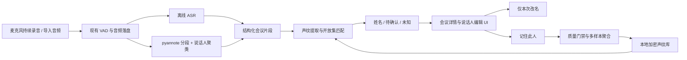

# HarmonyOS 端侧声纹注册、识别与说话人编辑方案

- 状态：定稿，可进入实现
- 日期：2026-08-25
- 目标工程：HarmonyOS 手机/平板应用 `/Users/cannkit/ASR`
- 目标场景：固定 2–10 人的小团队会议，同时允许未注册人员以“未知说话人”出现

## 1. 结论

采用“预训练声纹编码器 + 多样本声纹模板 + 开放集阈值判断 + 人工确认闭环”，不为每位用户训练模型，也不在手机上做梯度更新。

本人支持主动注册。其他参会者无需主动录制注册语音：会议转录完成后，用户给同一人标记质量合格的片段，并明确点击“记住此人”；累计至少 8 秒无重叠语音后，系统即可建立候选声纹。以后会议只有最高余弦相似度达到 `0.60` 才显示姓名，否则保留“未知说话人”。

端侧声纹模型定为 `speech_campplus_sv_zh_en_16k-common_advanced`：ONNX 26.97 MB、192 维 embedding、2 线程。Mac M4 上的 AISHELL-3、VoxCeleb1 和 AISHELL-4 实测已经完成，它比现有 38 MB 模型更小、更快，并显著改善跨录音环境表现；不采用现有模型，也不采用 68 MB ERes2NetV2。第一版不进行模型微调。

## 2. 范围与边界

### 2.1 必须支持

1. 本人通过 3 轮引导录音主动注册声纹。
2. 录音和导入音频都能进行转录、说话人分离和已知身份识别。
3. 用户可将一个会议说话人改名，选择仅本次生效或“记住此人”。
4. 其他人通过用户确认的会议片段建立声纹，无需对方进入注册页面。
5. 同一人物可跨会议持续使用同一个身份，后续可以改名、重建或删除。
6. 未达到可靠阈值的说话人必须保持未知，不能强行分配最相似姓名。
7. 固定测试中心可在 App 内运行，展示准确率、未知拒识和端侧耗时。
8. 声纹模板只保存在本机，不上传、不随普通转录导出。

### 2.2 第一版不做

- 不做云端声纹库或跨设备同步。
- 不做边录边实时显示最终说话人身份；先保证录音链路不受阻塞，片段关闭或会议结束后处理。
- 不做每人独立分类器，也不做手机端模型训练或增量微调。
- 不把声纹用于登录、支付或其他安全认证；本功能只用于会议转录标注。
- 不从未经用户确认的自动识别结果中自学习。

## 3. 现有工程基线

工程已经具备大部分底层能力：

- ArkTS UI + `ThreadWorker`，端侧推理由 `sherpa_onnx` 1.13.3 完成。
- 流式与离线 Paraformer、SenseVoice、标点和 Silero VAD 已集成。
- `StreamingSherpaWorker.ets` 已集成 pyannote 分段模型和 3D-Speaker embedding 模型。
- 已有 `SpeakerEmbeddingExtractor`、`SpeakerEmbeddingManager`、说话人聚类和固定阈值搜索。
- 已有隐藏的主动声纹注册逻辑，但当前只录一次、只保存一个 embedding，并以姓名作为身份键。
- 当前声纹保存在普通 Preferences JSON 中；固定匹配阈值为 `0.60`。
- 当前说话人结果最终被格式化成字符串，UI 无法可靠编辑某个说话人、回填整组片段或保存跨会议映射。
- 持续录音已经具有“采集、落盘、队列转录”解耦结构，应继续保持，不能把说话人推理放到采集回调中。

模型定稿：

| 模块 | 资产 | 大小约值 | 结论 |
|---|---|---:|---|
| 说话人分段 | pyannote segmentation int8 | 1.5 MB | 保留 |
| 声纹 embedding | CAM++ 中英双语 192 维 | 26.97 MB | 最终发布模型 |
| 旧声纹 embedding | 当前 ERes2Net 中文 512 维 | 37.76 MB | 替换并移出发布包 |
| 对照 embedding | ERes2NetV2 中文 192 维 | 68.13 MB | 不进入发布包 |

整个 `rawfile` 当前约 863 MB，声纹模型不是包体的主要来源。固定测试音频必须放入调试/测试产品，而不是继续扩大正式发布包。

实施时使用以下唯一配置：

```text
modelId = speech_campplus_sv_zh_en_16k-common_advanced
modelSha256 = aa3cfc16963a10586a9393f5035d6d6b57e98d358b347f80c2a30bf4f00ceba2
embeddingDim = 192
embeddingThreads = 2
identityThreshold = 0.60
clusteringThreshold = 0.85
```

直接替换 `StreamingSherpaWorker.ets` 中的声纹模型路径和聚类阈值，并将 `Index.ets` 的 `VOICEPRINT_MODEL_ID`、`VOICEPRINT_EMBEDDING_DIM` 更新为新模型。模型放入新的 CAM++ 资源目录，确认引用切换后删除正式资源中的旧 38 MB ONNX；68 MB 模型继续留在开发资产或本地评测区，不进入 HAP。

## 4. 方案比较

### 方案 A：单向量 + 固定阈值

沿用当前实现，每人保存一个 embedding，搜索分数超过 0.60 就认人。

- 优点：改动最少。
- 缺点：一次误标就会覆盖身份；不适应远近距离、设备和会议变化；阈值未校准；不能表达未知、待确认和稳定度。
- 结论：只适合技术演示，不用于产品。

### 方案 B：多样本模板 + 人工确认 + 开放集识别

本人保存 3 个通过质量门禁的注册 embedding，并计算 L2 归一化中心向量；会议确认样本用于受控更新。识别时将同一 cluster 的至少 3 段或 4 秒有效语音聚合后与最多 10 个中心向量比较，设置“已知、未知”两态策略。

- 优点：不训练、端侧开销低、可纠错、适合 2–10 人小团队。
- 缺点：需要结构化转录结果、版本化存储和阈值评测。
- 结论：采用。

### 方案 C：端侧增量分类器或每人微调

- 优点：理论上可针对团队适配。
- 缺点：需要训练数据、负样本和防灾难性遗忘；耗电、难回滚、易被误标污染。
- 结论：第一版拒绝。只有统一预训练模型在目标域评测长期不达标时，才在开发机上做共享模型的域适配。

## 5. 总体架构



### 5.1 模块职责

| 模块 | 职责 | 建议位置 |
|---|---|---|
| `SpeakerTypes` | 统一 Profile、Turn、Assignment、Quality 类型 | `ets/common` |
| `SpeakerInferenceService` | embedding 提取、多原型打分、开放集策略 | worker 内部或 `ets/services/speaker` |
| `SpeakerEnrollmentService` | 主动注册、会议标记建档、质量门禁 | `ets/services/speaker` |
| `SpeakerProfileStore` | 加密档案、迁移、CRUD、模型版本隔离 | `ets/services/speaker` |
| `MeetingSpeakerStore` | 每次会议的 cluster → person 映射和人工修订 | `ets/services/speaker` |
| `SpeakerTestRunner` | 固定数据集、指标计算、真机性能采样 | `ets/services/speaker` |
| `MeetingDetail` | 结构化转录、播放、改名、记住此人 | 新页面 |
| `SpeakerProfiles` | 人物列表、状态、重命名、重建、删除 | 新页面 |
| `SpeakerTestCenter` | 固定测试 UI | 新页面或诊断入口 |

不新增服务器。现有 `StreamingSherpaWorker` 先继续承载模型生命周期，但应将纯算法和类型逐步拆出，避免该文件继续膨胀。

## 6. 核心数据模型

姓名不能继续作为声纹库主键。人物必须使用稳定的 `personId`，否则改名、同名人员和跨会议关联都会出错。

```text
SpeakerProfile
  schemaVersion: 2
  personId: UUID
  displayName: string
  role: self | participant
  state: provisional | stable | needsReRegister
  modelId: string
  embeddingDim: 192
  enrollmentEmbeddings: VoicePrototype[]
  centroid: number[192]
  sampleCount: number
  totalSpeechMs: number
  sourceSessionCount: number
  createdAt / updatedAt: number

VoicePrototype
  prototypeId: UUID
  embedding: number[192]
  speechMs: number
  qualityScore: number
  source: activeEnrollment | meetingLabel
  evidence: { meetingId, segmentId, startMs, endMs }?

SpeakerTurn
  turnId: UUID
  meetingId: UUID
  clusterId: string
  startMs / endMs: number
  text: string
  identity: unknown | automatic | confirmed
  personId?: UUID
  matchScore?: number

MeetingSpeakerAssignment
  meetingId: UUID
  clusterId: string
  personId?: UUID
  displayNameOverride?: string
  source: automatic | user
```

结构化数据是本方案的前置条件。Worker 不再只返回拼好的 `[S1 00:00-00:05] 文本`，而是返回 `SpeakerTurn[]`；文本格式只在展示和导出时生成。

## 7. 注册与建档流程

### 7.1 本人主动注册

1. 用户进入“我的声纹”，显示三轮录音，而不是按住一次录完。
2. 每轮采集 4–6 秒自然说话；允许自由内容，不要求固定口令。
3. 每轮执行 VAD 裁剪、时长、音量、削波和单说话人检查。
4. 三轮 embedding 做两两一致性检查；离群轮次要求重录。
5. 保存三个合格 embedding，并计算 L2 归一化中心向量，建立 `role=self` 的稳定档案；原始注册音频默认不保存。

### 7.2 其他参会者会议标记建档

1. 会议完成后先得到匿名聚类，例如“说话人 A”。
2. 用户点击任意说话人标签，可执行：
   - “仅本次改名”；
   - “关联已有联系人”；
   - “新建并记住此人”。
3. 选择“记住此人”时，系统从该 cluster 中预选最长、无重叠、质量较高的片段，用户可播放、取消或补选。
4. 只有累计至少 8 秒有效无重叠语音通过门禁，才创建或更新 `provisional` 档案；优先从不少于 3 段中取样，避免单一短句决定身份。
5. 当前会议内立即将同 cluster 的所有片段回填为该姓名。
6. 在后续不同会议再次得到用户确认，或积累至少两个会话来源后，升级为 `stable`。

标记一段就足以给当前会议改名，但不足以建立长期声纹。这一差异必须在 UI 上明确表达。

### 7.3 质量门禁

候选片段必须同时满足：

- 主动注册固定为 3 次、每次 4–6 秒；会议建档累计至少 8 秒无重叠语音。
- 排除 pyannote 判断为重叠说话的区域。
- 排除严重削波、数字静音、过低音量和极低 VAD 语音占比。
- 同一人物候选 embedding 的内部相似度必须达到模型校准门限。
- 与现有其他人物过于接近时禁止静默建档，要求用户复核。
- 不把降噪后的合成音频作为唯一建档来源，避免处理失真成为身份特征。

## 8. 开放集识别策略

CAM++ 身份匹配阈值固定为 `0.60`，说话人聚类阈值固定为 `0.85`。两者来自本次 Mac M4 评测，并随 `modelId` 和配置版本保存，未来替换模型时必须重新评测，不能跨模型沿用。

对一个会议 cluster：

1. 同一 cluster 累计至少 3 段或 4 秒有效语音，未达到时只显示匿名 cluster。
2. 分别提取可靠 turn embeddings，聚合并 L2 归一化为 query center。
3. 与最多 10 个 Profile 的归一化 `centroid` 计算余弦相似度。
4. 取最高分进行开放集判断。

```text
bestScore >= 0.60  -> 自动显示姓名
bestScore < 0.60   -> 未知说话人
```

多个 cluster 匹配到同一个 `personId` 时自动合并显示，解决 AISHELL-4 实测中的过分拆分。门限记录在版本化配置中；模型替换后旧模板标记为 `needsReRegister`，禁止不同模型生成的 embedding 混用。

自动识别结果默认不能更新声纹。只有“用户明确确认”的片段才可加入注册样本，并重新计算归一化中心向量；需要限制样本数并优先保留跨会话、高质量且相互一致的样本。

## 9. 端侧执行与资源策略

- 录音回调只做现有的轻量分段和落盘，不等待 ASR、diarization 或 embedding。
- 片段关闭后按队列顺序执行 ASR；整段会议完成后再执行说话人聚类和身份匹配。
- CAM++ 按需懒加载并固定 2 个线程，ASR 正在密集解码时不并行运行声纹后处理。
- App 正式包只保留 26.97 MB CAM++；旧 38 MB 和 68 MB 候选都不发布。
- 2–10 人、每人少量 192 维 Float32 样本和一个中心向量，存储开销可忽略。
- 长音频仍采用有界队列、可恢复任务和可取消处理，页面退出或系统回收后能从落盘记录继续。

建议验收目标，最终以目标华为手机实测为准：

| 指标 | 第一版目标 |
|---|---:|
| 已提取 query 后匹配 10 人 | p95 < 50 ms |
| 30 秒建档音频 embedding 提取 | < 3 秒 |
| 3 分钟会议完整说话人后处理 | RTF ≤ 0.5 |
| 声纹功能正式包增量 | 约 26.97 MB |
| 说话人处理额外峰值内存 | ≤ 200 MB |
| 未知识别误接纳率 | FAR ≤ 1% 的评测点 |
| 已知人员正确命名率 | 在 FAR 目标下尽量 ≥ 90%，不足则更多输出未知 |

错误命名比显示“未知”更难纠正，所以准确优先于覆盖率。

## 10. UI 信息架构

### 10.1 首页

- 保留实时按住说话和持续录音入口。
- 增加“人物与声纹”入口，展示“本人已注册 / N 位常用参会者”。
- 声纹功能不再藏在调试常量后面。

### 10.2 会议详情

- 转录按 `SpeakerTurn` 展示，每个说话人使用颜色一致的姓名标签。
- 点击标签打开底部面板：
  - 仅本次改名；
  - 关联已有联系人；
  - 新建联系人；
  - 记住此人；
  - 标为未知或撤销误认。
- 修改 cluster 映射后立即刷新本会议全部同 cluster 片段。
- “记住此人”显示采样进度，例如“已选 3 段 / 有效 17 秒”，并允许逐段试听。

### 10.3 人物与声纹

- 展示姓名、本人/参会者、候选/稳定、样本时长和最近确认时间。
- 支持改名、增加样本、重建声纹和删除。
- 改名修改 `displayName`，不改变 `personId`；历史会议按 personId 关联后自动显示新名称。

### 10.4 固定测试中心

- 列出音频、数据集、时长、已知人数和未知人数。
- 展示处理进度、DER/JER、已知人员命名正确率、未知误接纳率、耗时、RTF 和错误矩阵。
- 固定运行 CAM++ 回归；开发诊断构建可选择旧模型复核历史基线，但正式包不包含旧模型。
- 测试结果可导出 JSON；正式发布构建隐藏该入口并排除测试音频。

## 11. 存储、安全与迁移

声纹属于敏感生物特征数据，按以下规则处理：

- 使用 HUKS 生成设备绑定的 AES-GCM 密钥，加密保存版本化 Profile 数据。
- 不再把 embedding 以明文 JSON 放入 Preferences。
- 声纹数据默认排除系统备份；若当前备份配置无法细粒度排除，则声纹容器不参与备份，必要时关闭模块级备份。
- 普通“导出录音与转录”不包含声纹向量、匹配分数和密钥。
- 日志禁止打印 embedding、完整档案或敏感姓名列表。
- 删除人物时同步清理向量、映射和可恢复缓存；保留历史转录文本时将其变为普通显示名快照。
- 建立他人声纹前提示用户确认其有权保存；产品文案明确用途仅为本机会议标记。

迁移策略：检测当前 `asr_voiceprints/profiles` 的旧结构及 `modelId + embeddingDim`。旧模型是 512 维，CAM++ 是 192 维，两者不能转换；因此只迁移姓名和人物资料，将状态标记为 `needsReRegister`，明确提示重新注册。不能静默丢弃，也不能继续使用错误维度。新档案写入加密存储并校验成功后删除旧 Preferences。

## 12. 固定数据集与评测设计

### 12.1 数据

| 数据 | 用途 | 是否有真值 |
|---|---|---|
| AISHELL-3 | 40 名中文说话人；20 人调参、10 名已注册测试、10 名未知测试，并加入 10 dB 噪声和混响 | speaker id 真值 |
| AISHELL-4 | 多说话人中文会议、重叠语音 | 使用官方 RTTM 真值 |
| VoxCeleb1 本地子集 | 40 名跨视频说话人，注册与测试来自不同视频；只本地评测、不分发 | speaker id 真值 |
| AliMeeting | App 内固定中文远场会议回归 | 对应官方样本时使用 speaker/RTTM 真值 |
| 用户已有 14 条会议音频 | 真机稳定性、耗时和回归 | 只有能对应官方样本的部分用于准确率 |
| 本机实际会议录音 | 目标域回归 | 经人工标注后进入私有测试集 |

公开数据的许可证和分发条款必须在纳入 App 前核对。完整数据集只在 Mac 评测；App 内只放允许分发的短片段和真值清单。

### 12.2 评测协议

1. 按 speaker 划分 enrollment 和 test，禁止同一音频片段同时出现在两侧。
2. 主动注册使用 3 段、每段 4–6 秒；会议建档使用至少 8 秒合格语音。
3. 每轮保留一批未注册人员，测试开放集 unknown。
4. 分别测试近讲、远场、噪声、短句、跨会议和重叠语音。
5. 后续模型回归继续使用完全相同的音频切分、质量门禁和打分逻辑。

核心指标：

- 声纹验证：EER、FAR、FRR。
- 开放集识别：已知 Top-1、DIR@FAR=1%、未知误接纳率、混淆矩阵。
- 说话人分离：DER、JER、说话人数误差。
- 产品链路：最终 turn 姓名正确率、未知占比、人工修正次数。
- 端侧：模型加载时间、RTF、峰值内存、包体增量和 10/30 分钟任务温升。

本轮模型选择已经完成：CAM++ 在中文聚合测试达到 `97.5% / 95%` 已知识别/未知拒识，在跨视频测试达到 `96% / 100%`，embedding RTF 为 `0.0050`。AISHELL-4 整场 DER 为 `7.93%`、RTF 为 `0.0747`。详细记录见 `docs/evaluation/2026-08-25-speaker-model-selection.md`。

### 12.3 测试资产组织

- Mac：新增 `tools/speaker_eval/`，下载公开数据、生成切片、跑模型并输出阈值配置。
- App：新增测试产品配置，只打包单一格式的精选音频、RTTM/JSON 真值和 manifest。
- 删除同一测试音频同时保存 WAV/MP3/M4A 的重复做法；正式 release 不包含固定测试素材。
- App 与 Mac 共享 manifest 字段和阈值配置，确保评测口径一致。

## 13. 失败模式与降级

| 失败 | 用户影响 | 处理 |
|---|---|---|
| 声纹模型加载失败 | 无法识别人名 | ASR 和匿名说话人分离继续工作 |
| diarization 失败 | 无说话人 turn | 显示普通转录，不丢音频 |
| 样本重叠或质量不足 | 无法建档 | 说明原因并建议补选，不保存半成品 |
| 最高分不足 0.60 | 无法可靠命名 | 输出未知说话人 |
| 用户误标 | 模板污染 | 新样本先进入候选；支持撤销和重建 |
| 模型版本升级 | 旧向量不可比 | 标记 `needsReRegister`，不跨模型搜索 |
| 加密档案损坏 | 声纹库不可读 | 隔离损坏文件，保留会议文本并提示重建 |
| Worker 被系统回收 | 后处理停止 | 任务状态落盘，下次进入页面续跑 |
| 内存压力 | 页面卡顿或退出 | 串行加载模型、限制原型数、避免复制整段 PCM |

任何声纹失败都不能破坏录音和 ASR 主链路。

## 14. 验证计划

### 单元测试

- Profile v1 → v2 迁移、加密存取、重命名和删除。
- 三段/时长累计、中心向量计算和 `0.60` 已知/未知阈值。
- 质量门禁：时长、削波、静音、重叠、离群 embedding。
- cluster 改名只影响本会议，person 改名影响全部关联会议。
- 模型 id 不一致时拒绝载入。

### 集成测试

- Worker 返回结构化 `SpeakerTurn[]`，ASR 失败和 diarization 失败可分别降级。
- 主动注册三轮流程、会议片段建档、关联已有联系人。
- 持续录音与导入音频均能产生可编辑说话人结果。
- 中途退出、杀进程、升级模型后任务恢复和数据迁移。
- 导出包含姓名与 turn，但不包含 embedding。

### 真机验收

- 在目标华为手机连续录音 30 分钟，确认无采集丢帧。
- 分别运行 2、5、10 人声纹库和未知人员混入场景。
- 跑固定测试中心并导出指标，与 Mac 基线对齐。
- 检查冷启动、模型加载、峰值内存、耗电、温升和后台恢复。

## 15. 实施阶段

### 阶段 0：模型与阈值基线（已完成）

- 已使用 AISHELL-3、VoxCeleb1 和 AISHELL-4 完成 Mac M4 评测。
- 已选择 26.97 MB、192 维 CAM++，2 线程。
- 已确定身份阈值 `0.60`、聚类阈值 `0.85`；实施时固化为版本化配置。

### 阶段 1：结构化数据与安全存储

- 新增 Speaker 类型、ProfileStore、MeetingSpeakerStore。
- 完成旧 Preferences 声纹迁移和 HUKS 加密。
- 将 Worker 的说话人结果从字符串升级为结构化 turns。

### 阶段 2：注册与人工建档

- 完成本人三轮主动注册。
- 完成会议 cluster 改名、关联人物、选段和“记住此人”。
- 实现质量门禁、候选/稳定状态和撤销。

### 阶段 3：跨会议开放集识别

- 三段或 4 秒累计、中心向量打分和 known/unknown 策略。
- 将匹配到同一 `personId` 的多个 cluster 合并显示。
- 自动回填当前会议和后续会议，保留用户确认闭环。

### 阶段 4：测试中心与真机验收

- 将精选公开数据和真值加入测试产品。
- 在 App 展示准确率和端侧性能。
- 完成 30 分钟真机压力测试和发布包资产裁剪。

## 16. 交付验收标准

满足以下条件才认为功能完成：

1. 本人可主动注册，其他人可由会议中 3–5 个确认片段建立候选声纹。
2. “仅本次改名”和“记住此人”行为明确且可回归测试。
3. 录音和导入音频都返回结构化说话人 turn，并能编辑。
4. 固定团队已知人员能跨会议识别，未注册人员不会被强制分配姓名。
5. 公开真值集和真机测试均输出可复现指标，不再只看分段稳定性。
6. 无每人训练步骤，正式包只包含定稿的 CAM++ 模型。
7. 声纹加密保存在本机，可查看、改名、重建和彻底删除。
8. 声纹或 diarization 失败时，录音与普通 ASR 仍可使用。

## 17. 参考

- [sherpa-onnx HarmonyOS 端侧说话人识别](https://k2-fsa.github.io/sherpa/onnx/harmony-os/speaker-identification.html)
- [sherpa-onnx Speaker Embedding API](https://github.com/k2-fsa/sherpa-onnx/blob/master/sherpa-onnx/c-api/docs/speaker-embedding.dox)
- [CAM++ 中英双语模型说明](https://modelscope.cn/models/iic/speech_campplus_sv_zh_en_16k-common_advanced)
- [3D-Speaker 官方基准](https://github.com/modelscope/3D-Speaker#benchmark)
- [AISHELL-3 数据卡](https://huggingface.co/datasets/AISHELL/AISHELL-3)
- [AISHELL-4 论文](https://arxiv.org/abs/2104.03603)
- [pyannote 声纹识别与未知说话人](https://docs.pyannote.ai/tutorials/identification-with-voiceprints)
- [OpenHarmony HUKS](https://gitee.com/openharmony/security_huks)
